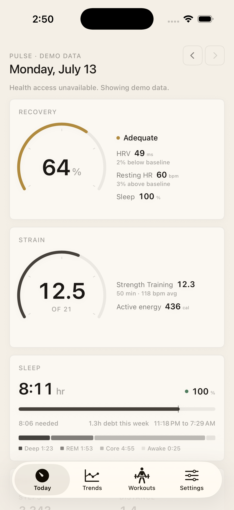
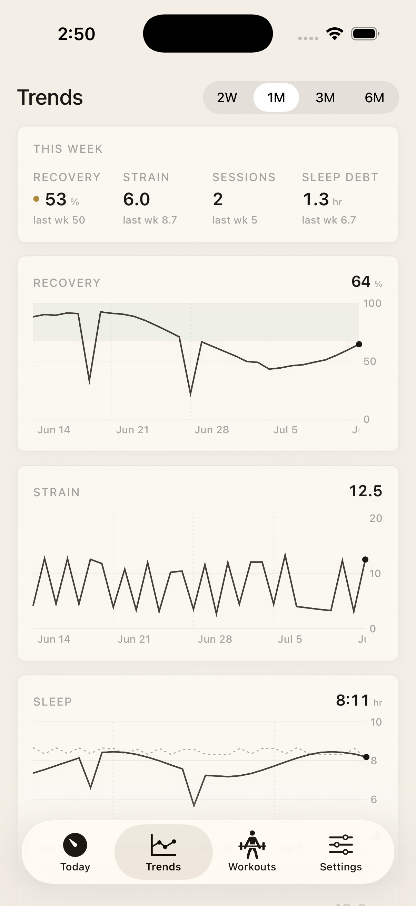
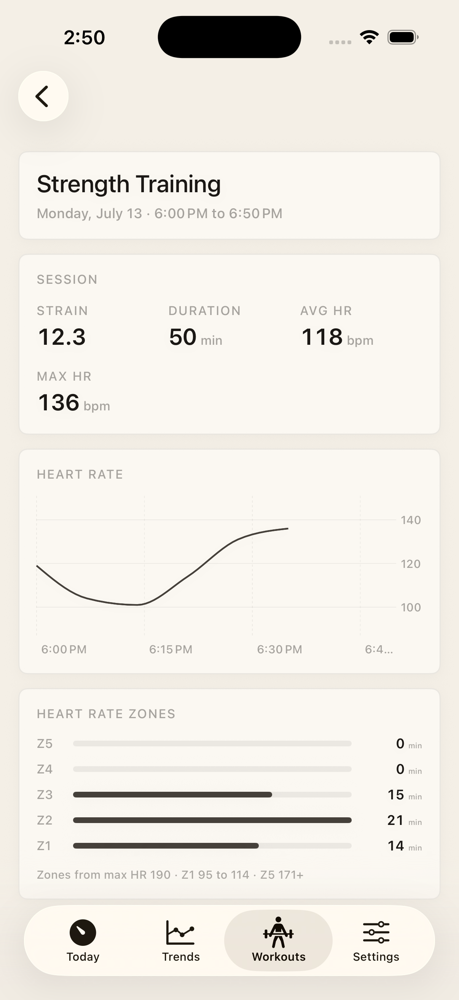

# Pulse

**A personal recovery dashboard for Apple Watch.** Pulse turns the data your
Apple Watch already collects into Whoop style recovery, strain, and sleep
scores, computed entirely on your iPhone from your own history. Native
SwiftUI, iOS 17+, no dependencies, nothing leaves the device.

🔗 **Live overview:** __PAGES_URL__

<p>
  
  
  
</p>

## What it does

| Screen | What it shows |
|---|---|
| **Today** | Recovery dial (0 to 100%), strain dial (0 to 21), sleep against need with the stage breakdown, day vitals. Step back through any past day. |
| **Trends** | This week versus last, then recovery, strain, sleep, HRV, resting HR, and VO₂ max over two weeks to six months. |
| **Workouts** | Every session with its strain; the detail view has the heart rate trace and time in each zone. |
| **Settings** | Data source, max HR (strain zones), base sleep need. |

## How the scores work

- **Recovery** takes last night's HRV (log scale) and resting HR, standardizes
  each against your personal rolling baselines (14 day HRV, 28 day resting HR),
  and blends them with sleep performance at 55 / 25 / 20. Green at 67 and up,
  amber from 34 to 66, red below 34.
- **Strain** accumulates time in heart rate zones (Z1 to Z5 as a share of max
  HR) across workouts, plus non workout active energy, on a logarithmic 0 to 21
  scale. Rest days land near 3 to 5, a solid session near 10 to 13.
- **Sleep** measures hours slept against a personal need: a base plus a term
  scaled by yesterday's strain plus any sleep debt built up over the week.

The scoring engine is pure, testable Swift; every value is reproducible from
its inputs.

## How it's built

- **SwiftUI and Swift Charts**, iOS 17+, iPhone. Zero third party dependencies.
- **HealthKit** (read only) for HRV, heart rate, sleep stages, energy, VO₂ max.
- **On the device**: no account, no backend, no network. A bundled 180 day demo
  dataset stands in when HealthKit is unavailable (for example, the simulator).
- **Design**: a deliberate warm studio system. A paper canvas, one typeface
  with weight reserved for data values, and status color used only where a
  metric genuinely carries a status.

## Install on your iPhone

1. Open `Pulse.xcodeproj` in Xcode.
2. Target **Pulse → Signing & Capabilities**: check *Automatically manage
   signing* and pick your personal team (a free Apple ID works; add it in
   Xcode → Settings → Accounts).
3. If the bundle id collides, change `com.wchristie.pulse` to anything unique.
4. Enable Developer Mode on the iPhone (Settings → Privacy & Security →
   Developer Mode), select it as the run destination, press **Run**.
5. On first launch, trust the developer profile if prompted (Settings →
   General → VPN & Device Management), then grant the Health permissions sheet
   (**Turn On All**). Pulse is read only; it cannot modify your Health data.

Free team builds expire after seven days; press Run again to refresh.

## Known limitations

From an adversarial multi agent code review (findings in
`docs/review-2026-07-06.json`); accepted as they are for a personal app:

- Recovery baselines use the last N *recorded* days, not calendar days.
- Sleep bucketing uses the device's current time zone, so heavy travel can misfile a night.
- HealthKit cannot distinguish permission denied from no data.
- Workouts that cross midnight count on their start day.
- Custom dials and charts have no VoiceOver labels yet.

## Roadmap

- **Phase 2, planner and exercise tracking**: a workout planner (plan days,
  exercises, sets, reps, RIR), session logging, and plan adherence shown
  alongside recovery and strain.
- Later: a watchOS complication with today's recovery; respiratory rate and
  wrist temperature folded into the recovery model.

## Development

```sh
# Build and run in the simulator
xcodebuild -project Pulse.xcodeproj -scheme Pulse \
  -destination 'platform=iOS Simulator,name=Pulse-iPhone' \
  -derivedDataPath build CODE_SIGNING_ALLOWED=NO build
xcrun simctl install Pulse-iPhone build/Build/Products/Debug-iphonesimulator/Pulse.app
xcrun simctl launch Pulse-iPhone com.wchristie.pulse

# Regenerate the demo dataset from an Apple Health export
python3 tools/export_to_demo.py path/to/export.xml Pulse/Resources/DemoData.json
```

---

<sub>Built by William Christie. Personal project, not affiliated with WHOOP or Apple.</sub>
